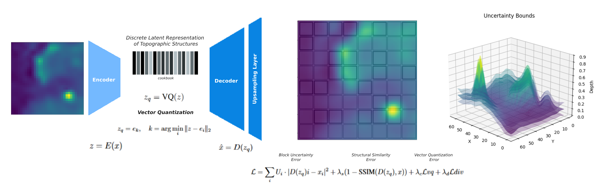

# Ocean Floor Mapping with Uncertainty-Aware Deep Learning
## ICLR 2025 Tackling Climate Change with Machine Learning Workshop - Accepted


This repository contains the implementation of "Learning Enhanced Structural Representations with Block-Based Uncertainties for Ocean Floor Mapping", a deep learning approach for enhancing bathymetric data resolution while providing calibrated uncertainty estimates.



## Abstract

Accurate ocean modeling and coastal hazard prediction depend on high-resolution bathymetric data; yet, current worldwide datasets are too coarse for exact numerical simulations. While recent deep learning advances have improved earth observation data resolution, existing methods struggle with the unique challenges of producing detailed ocean floor maps, especially in maintaining physical structure consistency and quantifying uncertainties. This work presents a novel uncertainty-aware mechanism using spatial blocks to efficiently capture local bathymetric complexity based on block-based conformal prediction. Using the Vector Quantized Variational Autoencoder (VQ-VAE) architecture, the integration of this uncertainty quantification framework yields spatially adaptive confidence estimates while preserving topographical features via discrete latent representations. With smaller uncertainty widths in well-characterized areas and appropriately larger bounds in areas of complex seafloor structures, the block-based design adapts uncertainty estimates to local bathymetric complexity. Compared to conventional techniques, experimental results over several ocean regions show notable increases in both reconstruction quality and uncertainty estimation reliability. This framework increases the reliability of bathymetric reconstructions by preserving structural integrity while offering spatially adaptive uncertainty estimates, so opening the path for more solid climate modeling and coastal hazard assessment. 

*Comparison of different models: Input, Ground Truth, and predictions from SRCNN, ESRGAN, and VQVAE with their respective uncertainty estimates.*

**_Model Comparison in 2D_**


**Model Results**

**Uncertainty Aware SRCNN Results**


**Uncertainty Aware ESRGAN Results**


**Uncertainty Aware VQVAE - Block Size 1 Results**


**Uncertainty Aware VQVAE - Block Size 2 Results**


**Uncertainty Aware VQVAE - Block Size 4 Results**


**Uncertainty Aware VQVAE - Block Size 8 Results**


**Uncertainty Aware VQVAE - Block Size 64 Results**


## Citation

If you use this code in your research, please cite:

```bibtex
@inproceedings{minoza2025learning,
  title={Learning Enhanced Structural Representations with Block-Based Uncertainties for Ocean Floor Mapping},
  author={Minoza, Jose Marie Antonio},
  booktitle={ICLR 2025 Workshop on Tackling Climate Change with Machine Learning},
  url={https://www.climatechange.ai/papers/iclr2025/14},
  doi = {10.48550/arxiv.2504.14372}
  year={2025}
}

@inproceedings{ocean-floor-mapping2025,
  title={Learning Enhanced Structural Representations with Block-Based Uncertainties for Ocean Floor Mapping},
  author={Jose Marie Antonio Minoza},
  booktitle={ICLR Workshop on Tackling Climate Change with Machine Learning},

  year={2025}

}

@misc{ocean-floor-mapping2025_modelzoo,
  doi = {10.5281/ZENODO.15272540},
  author = {Minoza, Jose Marie Antonio},
  title = {Model Zoo: Learning Enhanced Structural Representations with Block-Based Uncertainties for Ocean Floor Mapping},
  publisher = {Zenodo},
  year = {2025},
  copyright = {Creative Commons Attribution 4.0 International}
}
```

## License

This project is licensed under the MIT License - see the LICENSE file for details.

## Acknowledgments

- GEBCO for providing bathymetric data
- Previous work in deep learning-based super-resolution

## Contributing

1. Fork the repository
2. Create your feature branch (`git checkout -b feature/AmazingFeature`)
3. Commit your changes (`git commit -m 'Add some AmazingFeature'`)
4. Push to the branch (`git push origin feature/AmazingFeature`)
5. Open a Pull Request
